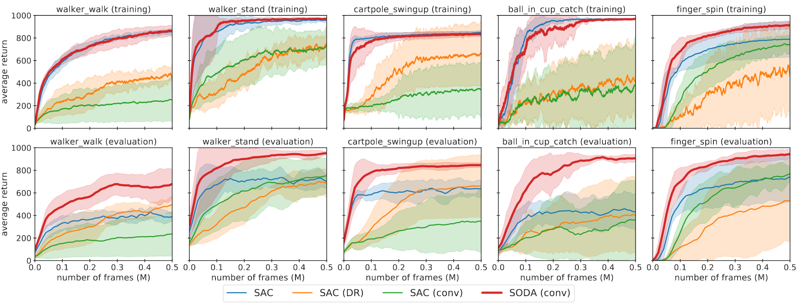

# DMControl Generalization Benchmark
Benchmark for generalization in continuous control from pixels, based on [DMControl](https://github.com/deepmind/dm_control).

Also contains an official implementation of

**Generalization in Reinforcement Learning by Soft Data Augmentation** (SODA)<br/>
by [Nicklas Hansen](https://nicklashansen.github.io/) and [Xiaolong Wang](https://xiaolonw.github.io/).

[[Paper]](https://arxiv.org/abs/2011.13389) [[Webpage]](https://nicklashansen.github.io/SODA/)


## Test environments

This repository provides two distinct benchmarks for visual generalization, *random colors* and *video backgrounds*:


Both benchmarks are offered in *easy* and *hard* variants. Samples are shown below.

**color_easy**<br/>


**color_hard**<br/>


**video_easy**<br/>


**video_hard**<br/>


By default, algorithms are trained for 500k frames and are continuously evaluated in both training and test environments. Environment randomization is seeded to promote reproducibility.


## Algorithms

This repository contains implementations of the following papers in a unified framework:

- [SODA (Hansen and Wang, 2020)](https://arxiv.org/abs/2011.13389)
- [PAD (Hansen et al., 2020)](https://arxiv.org/abs/2007.04309)
- [RAD (Laskin et al., 2020)](https://arxiv.org/abs/2004.14990)
- [CURL (Srinivas et al., 2020)](https://arxiv.org/abs/2004.04136)
- [SAC (Haarnoja et al., 2018)](https://arxiv.org/abs/1812.05905)

using standardized architecture and hyper-parameters, wherever applicable. If you want to add an algorithm, feel free to send a pull request.


## Citation
<a name="citation"></a>
If you find our work useful in your research, please consider citing the paper as follows:

```
@article{hansen2020softda,
  title={Generalization in Reinforcement Learning by Soft Data Augmentation},
  author={Nicklas Hansen and Xiaolong Wang},
  year={2020},
  eprint={2011.13389},
  archivePrefix={arXiv},
  primaryClass={cs.LG}
}
```


## Setup
We assume that you have access to a GPU with CUDA >=9.2 support. All dependencies can then be installed with the following commands:

```
conda env create -f setup/conda.yml
conda activate dmcgen
sh setup/install_envs.sh
```


## Datasets
Part of this repository relies on external datasets. SODA uses the [Places](http://places2.csail.mit.edu/download.html) dataset for data augmentation, which can be downloaded by running

```
wget http://data.csail.mit.edu/places/places365/places365standard_easyformat.tar
```

You should familiarize yourself with [their terms](http://places2.csail.mit.edu/download.html) before downloading. After downloading and extracting the data, add your dataset directory to the `data_dirs` list in `src/augmentations.py`.

The `video_easy` environment was proposed in [PAD](https://github.com/nicklashansen/policy-adaptation-during-deployment), and the `video_hard` environment uses a subset of the [RealEstate10K](https://google.github.io/realestate10k/) dataset for background rendering. All test environments (including video files) are included in this repository, namely in the `src/env/` directory.


## Training & Evaluation

The `scripts` directory contains training and evaluation bash scripts for all the included algorithms. Alternatively, you can call the python scripts directly, e.g. for training call

```
python3 src/train.py \
    --algorithm soda \
    --aux_lr 3e-4 \
    --seed 0
```

to run SODA on the default task, `walker_walk`. This should give you an output of the form:

```
Working directory: logs/walker_walk/soda/0
Evaluating: logs/walker_walk/soda/0
| eval | S: 0 | ER: 26.2285 | ERTEST: 25.3730
| train | E: 1 | S: 250 | D: 70.1 s | R: 0.0000 | ALOSS: 0.0000 | CLOSS: 0.0000 | AUXLOSS: 0.0000
```
where `ER` and `ERTEST` corresponds to the average return in the training and test environments, respectively. You can select the test environment used in evaluation with the `--eval_mode` argument, which accepts one of `(train, color_easy, color_hard, video_easy, video_hard)`.


## Results

SODA demonstrates significantly improved generalization over previous methods, exhibits stable training, and has a sample efficiency that is comparable to the baseline SAC. Average return of SODA and baselines in the `train` and `color_hard` environments is shown below.



We also provide a full comparison of the SODA, PAD, RAD, and CURL methods on all four test environments. Results for `video_easy` and `color_hard` are shown below:


See [our paper](https://arxiv.org/abs/2011.13389) for more results.


## Acknowledgements

We want to thank the numerous researchers and engineers involved in work of which this implementation is based on. This benchmark is a product of our work on [SODA](https://arxiv.org/abs/2011.13389) and [PAD](https://arxiv.org/abs/2007.04309), our SAC implementation is based on [this repository](https://github.com/denisyarats/pytorch_sac_ae), the original DMControl is available [here](https://github.com/deepmind/dm_control), and the gym wrapper for it is available [here](https://github.com/denisyarats/dmc2gym). PAD, RAD, and CURL baselines are based on their official implementations provided [here](https://github.com/nicklashansen/policy-adaptation-during-deployment), [here](https://github.com/MishaLaskin/rad), and [here](https://github.com/MishaLaskin/curl), respectively.
