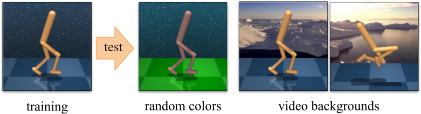
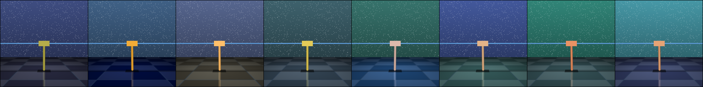
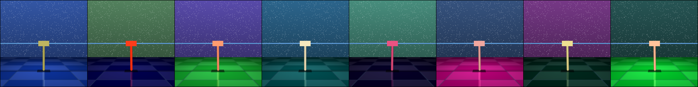
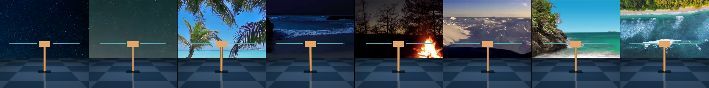
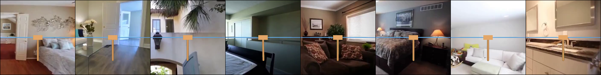
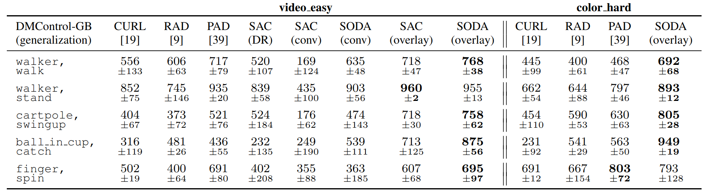

# DMControl Generalization Benchmark

**[07/01/2021] Added SVEA, DrQ, Distracting Control Suite, and reduced memory consumption by 5x**


Benchmark for generalization in continuous control from pixels, based on [DMControl](https://github.com/deepmind/dm_control).

Also contains official implementations of

**Stabilizing Deep Q-Learning with ConvNets and Vision Transformers under Data Augmentation** (SVEA)<br/>
[Nicklas Hansen](https://nicklashansen.github.io), [Hao Su](https://cseweb.ucsd.edu/~haosu), [Xiaolong Wang](https://xiaolonw.github.io)

[[Paper]](https://arxiv.org/abs/2107.00644) [[Webpage]](https://nicklashansen.github.io/SVEA)

and

**Generalization in Reinforcement Learning by Soft Data Augmentation** (SODA)<br/>
[Nicklas Hansen](https://nicklashansen.github.io), [Xiaolong Wang](https://xiaolonw.github.io)

[[Paper]](https://arxiv.org/abs/2011.13389) [[Webpage]](https://nicklashansen.github.io/SODA)


See [this repository](https://github.com/nicklashansen/svea-vit) for SVEA implemented using Vision Transformers.


## Test environments

The DMControl Generalization Benchmark provides two distinct benchmarks for visual generalization, *random colors* and *video backgrounds*:



Both benchmarks are offered in *easy* and *hard* variants. Samples are shown below.

**color_easy**<br/>


**color_hard**<br/>


**video_easy**<br/>


**video_hard**<br/>


This codebase also integrates a set of challenging test environments from the [Distracting Control Suite](https://arxiv.org/abs/2101.02722) (DistractingCS). Our implementation of DistractingCS includes environments of 8 gradually increasing randomization intensities. By default, algorithms are trained for 500k frames and are continuously evaluated in both training and test environments. Environment randomization is seeded to promote reproducibility.


## Algorithms

This repository contains implementations of the following algorithms in a unified framework:

- [SVEA (Hansen et al., 2021)](https://arxiv.org/abs/2107.00644)
- [SODA (Hansen and Wang, 2021)](https://arxiv.org/abs/2011.13389)
- [PAD (Hansen et al., 2020)](https://arxiv.org/abs/2007.04309)
- [DrQ (Kostrikov et al., 2020)](https://arxiv.org/abs/2004.13649)
- [RAD (Laskin et al., 2020)](https://arxiv.org/abs/2004.14990)
- [CURL (Srinivas et al., 2020)](https://arxiv.org/abs/2004.04136)
- [SAC (Haarnoja et al., 2018)](https://arxiv.org/abs/1812.05905)

using standardized architectures and hyper-parameters, wherever applicable. If you want to add an algorithm, feel free to send a pull request.


## Citation
<a name="citation"></a>
If you find our work useful in your research, please consider citing our work as follows:

```
@article{hansen2021stabilizing,
  title={Stabilizing Deep Q-Learning with ConvNets and Vision Transformers under Data Augmentation},
  author={Nicklas Hansen and Hao Su and Xiaolong Wang},
  year={2021},
  eprint={2107.00644},
  archivePrefix={arXiv},
  primaryClass={cs.LG}
}
```

for the SVEA method, and

```
@inproceedings{hansen2021softda,
  title={Generalization in Reinforcement Learning by Soft Data Augmentation},
  author={Nicklas Hansen and Xiaolong Wang},
  booktitle={International Conference on Robotics and Automation},
  year={2021},
}
```

for the SODA method and the DMControl Generalization Benchmark.


## Setup
We assume that you have access to a GPU with CUDA >=9.2 support. All dependencies can then be installed with the following commands:

```
conda env create -f setup/conda.yml
conda activate dmcgb
sh setup/install_envs.sh
```


## Datasets
Part of this repository relies on external datasets. SODA uses the [Places](http://places2.csail.mit.edu/download.html) dataset for data augmentation, which can be downloaded by running

```
wget http://data.csail.mit.edu/places/places365/places365standard_easyformat.tar
```

Distracting Control Suite uses the [DAVIS](https://davischallenge.org/davis2017/code.html) dataset for video backgrounds, which can be downloaded by running

```
wget https://data.vision.ee.ethz.ch/csergi/share/davis/DAVIS-2017-trainval-480p.zip
```

You should familiarize yourself with their terms before downloading. After downloading and extracting the data, add your dataset directory to the `datasets` list in `setup/config.cfg`.

The `video_easy` environment was proposed in [PAD](https://github.com/nicklashansen/policy-adaptation-during-deployment), and the `video_hard` environment uses a subset of the [RealEstate10K](https://google.github.io/realestate10k/) dataset for background rendering. All test environments (including video files) are included in this repository, namely in the `src/env/` directory.


## Training & Evaluation

The `scripts` directory contains training and evaluation bash scripts for all the included algorithms. Alternatively, you can call the python scripts directly, e.g. for training call

```
python3 src/train.py \
  --algorithm svea \
  --seed 0
```

to run SVEA on the default task, `walker_walk`. This should give you an output of the form:

```
Working directory: logs/walker_walk/svea/0
Evaluating: logs/walker_walk/svea/0
| eval | S: 0 | ER: 26.2285 | ERTEST: 25.3730
| train | E: 1 | S: 250 | D: 70.1 s | R: 0.0000 | ALOSS: 0.0000 | CLOSS: 0.0000 | AUXLOSS: 0.0000
```
where `ER` and `ERTEST` corresponds to the average return in the training and test environments, respectively. You can select the test environment used in evaluation with the `--eval_mode` argument, which accepts one of `(train, color_easy, color_hard, video_easy, video_hard, distracting_cs, none)`. Use `none` if you want to disable continual evaluation of generalization. Note that not all combinations of arguments have been tested. Feel free to open an issue or send a pull request if you encounter an issue or would like to add support for new features.


## Results

We provide test results for each of the SVEA, SODA, PAD, DrQ, RAD, and CURL methods. Results for `color_hard` and `video_easy` are shown below:



See [our paper](https://arxiv.org/abs/2107.00644) for additional results.


## Acknowledgements

We would like to thank the numerous researchers and engineers involved in work of which this work is based on. This repository is a product of our work on [SVEA](https://arxiv.org/abs/2107.00644), [SODA](https://arxiv.org/abs/2011.13389) and [PAD](https://arxiv.org/abs/2007.04309). Our SAC implementation is based on [this repository](https://github.com/denisyarats/pytorch_sac_ae), the original DMControl is available [here](https://github.com/deepmind/dm_control), and the gym wrapper for it is available [here](https://github.com/denisyarats/dmc2gym). The [Distracting Control Suite](https://arxiv.org/abs/2101.02722) environments were adapted from [this](https://github.com/google-research/google-research/tree/master/distracting_control) implementation. PAD, RAD, CURL, and DrQ baselines are based on their official implementations provided [here](https://github.com/nicklashansen/policy-adaptation-during-deployment), [here](https://github.com/MishaLaskin/rad), [here](https://github.com/MishaLaskin/curl), and [here](https://github.com/denisyarats/drq), respectively.
